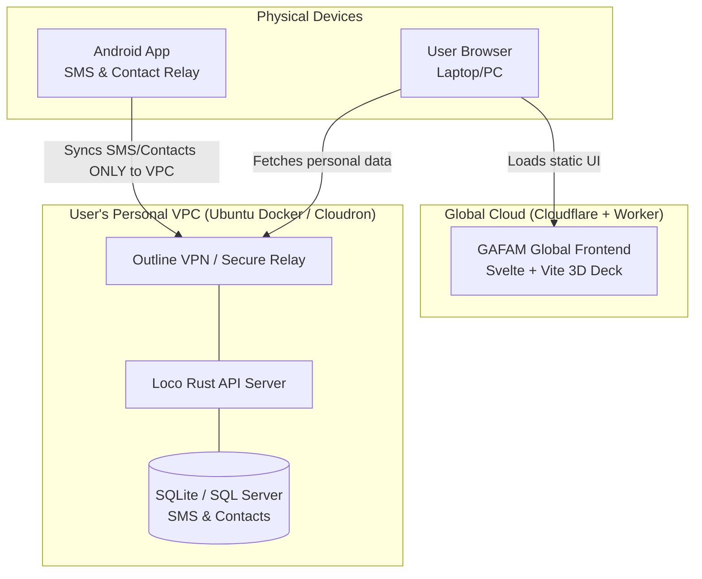

# GAFAM — Distributed Personal VPC & Communication Relay

GAFAM is a **Distributed Personal Virtual Private Cloud (VPC)** and communication command center. Instead of relying on centralized servers to hold your data, GAFAM empowers every user to host their own secure backend (via an Ubuntu Docker container or platforms like Cloudron). 

It is designed to virtualize necessary telecommunication and administrative interfaces into a highly secure, private cloud space, allowing you to securely receive administrative SMS verification codes, manage contacts, and sync data directly to your own personal SQL server.

---

## 🌟 The Core Philosophy: Distributed & Secure Independence

Modern life forces users to maintain physical smartphones, SIM cards, and static phone numbers to receive short-term administrative SMS codes and verifications. 

**GAFAM virtualizes and secures this dependency through a distributed architecture:**
1. **The Personal VPC (Docker/Ubuntu/Cloudron):** Every user has their own VPC. This is your personal backend. It contains an SQL server that acts as a buffer/relay for your personal page. It permanently saves and synchronizes your SMS and contacts whenever possible.
2. **Global Frontend with Edge Routing:** The main visual 3D command deck is hosted on a global domain (e.g., managed via Cloudflare and a basic Worker). When you log in, the global frontend connects *directly* to your personal VPC. 
3. **Android Relay Agent:** Your physical Android device acts as a relay. It intercepts incoming SMS and contacts and pushes them **exclusively** to your personal VPC. It does not talk to the global frontend. 
4. **Secure VPN Tunneling (Outline):** The architecture supports Outline VPN relays inside the VPC Docker. This allows for an ultra-secure, encrypted communication tunnel between the Android app, the web client, and your personal VPC services.

---

## 🏗️ The Distributed Architecture



### 1. Global Frontend
The domain name (GAFAM) and the frontend assets are served globally via edge networks like Cloudflare. A basic worker handles initial routing. It holds **zero personal data**.

### 2. User's Personal VPC (The Buffer Relay)
This is a Dockerized environment (e.g., Ubuntu or Cloudron) hosted at home or on a VPS. It contains:
- The SQL database storing all your SMS and contacts.
- The Loco Rust backend API.
- An Outline VPN relay to secure all incoming connections.

### 3. Android App Relay
The Android app is heavily restricted: it **only** connects to your personal VPC. Whenever it receives an SMS or a new contact is added, it pushes it directly to the VPC buffer.

---

## 🤝 Circle of Trust: P2P Authentication Delegation

Since the system is distributed and you may not have your physical phone with you, how do you log in from a new machine?

1. **Trusted Sibling Nodes:** You link your VPC with a trusted partner's VPC.
2. **Delegated Dispatches:** When accessing GAFAM from an unrecognized browser, request a "Backup P2P Token."
3. **Token Relay:** GAFAM routes the auth challenge to your partner's active node.
4. **Verification:** Your partner receives the code, verifies your identity, and shares the code to authorize your new device.

---

## 📂 Repository Architecture

```
GAFAM/
├── backend/                   # Loco Rust API Server (Deployed to User VPC)
│   ├── src/controllers/       # APIs for SMS, Contacts, Auth
│   └── README.md              
│
├── frontend/                  # Svelte + Vite Client (Deployed globally via Cloudflare)
│   ├── src/                   # 3D Board, routing to user VPCs
│   └── README.md              
│
├── android/                   # Android Relay Agent (Installed on physical phone)
│   ├── src/                   # SMS/Contact interceptors syncing to VPC
│   └── README.md              
│
└── README.md                  # Main philosophy & architectural vision
```

---

## 🚀 Quick Local Launch

Start the entire local stack (Loco Rust backend + Svelte frontend) in a single command:

```bash
./dev.sh
```

*   **3D Spatial Frontend:** `http://localhost:5173`
*   **Loco Rust API Server:** `http://localhost:5150`
