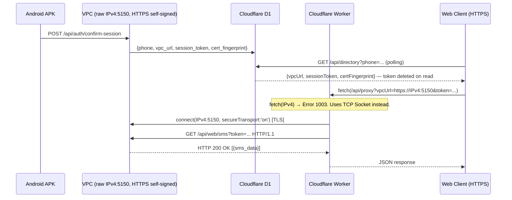

# TCP Socket Bypass — Cloudflare Error 1003

## Problem

The Web Client (`gafam.cloud`, HTTPS) needs to fetch SMS data from the VPC (`https://IPv4:5150`).

Two walls block a direct connection:
1. **Browser Mixed Content** — Chrome blocks `http://IP` calls from an `https://` page.
2. **Cloudflare Error 1003** — Workers' `fetch()` refuses raw IPv4 addresses (SSRF protection). A domain name is mandatory.

`nip.io` (a wildcard DNS mirror) was the first workaround but introduced an external dependency. **It has been removed.**

## Solution: TCP Sockets + Self-Signed TLS

Cloudflare exposes `cloudflare:sockets`, a low-level TCP API designed for database connections (Postgres, MySQL) which operate on raw IPv4. **TCP Sockets have no Error 1003 restriction.**

**VPC side** — Inspired by [Outline Server (Shadowbox)](https://github.com/OutlineFoundation/outline-server), the Go VPC generates a fresh ECDSA P-256 self-signed certificate on startup (no CA, no domain). Its SHA-256 fingerprint is announced to Cloudflare D1 on "Authorize Web Login".

**Worker side** — Instead of `fetch()`, the proxy opens `connect(IPv4:5150, { secureTransport: 'on' })`, writes an HTTP request manually over the TLS tunnel, and parses the raw response. Falls back to `fetch()` in local dev.

## Full Flow

> D1 only stores connection metadata. **SMS content never touches D1.**

## Security

| Property | Detail |
|---|---|
| No external DNS | Raw IPv4, no `nip.io`, no domain registration |
| Encrypted transit | TLS between Worker and VPC (self-signed cert) |
| Ephemeral tokens | Session token deleted from D1 on first read |
| Port freedom | TCP Sockets bypass Cloudflare's HTTP port whitelist |

## Changed Files

| File | Change |
|---|---|
| `vpc-relay/main.go` | ECDSA self-signed TLS at startup, `ListenAndServeTLS`, `CertFingerprint` global |
| `vpc-relay/api.go` | `cert_fingerprint` included in directory announcement |
| `deploy-vpc.sh` | Port `5150:5150` |
| `frontend/schema.sql` | Added `cert_fingerprint TEXT` column |
| `frontend/src/routes/api/directory/+server.ts` | Accepts fingerprint, raw IPv4 URL (no `nip.io`) |
| `frontend/src/routes/api/proxy/+server.ts` | TCP Socket with TLS, `fetch()` fallback for dev |
| `frontend/src/routes/[phone]/+page.svelte` | `certFingerprint` in state + localStorage |
