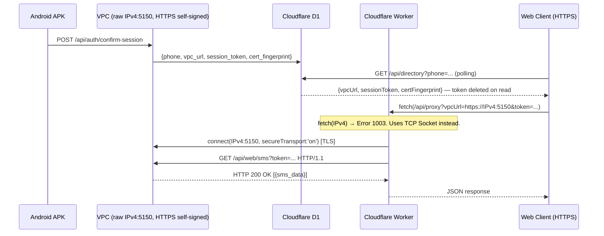

# TCP Socket Bypass — Cloudflare Error 1003

## Problem

The Web Client (`gafam.cloud`, HTTPS) needs to fetch SMS data from the VPC (`https://IPv4:5150`).

Two walls block a direct connection:
1. **Browser Mixed Content** — Chrome blocks `http://IP` calls from an `https://` page.
2. **Cloudflare Error 1003** — Workers' `fetch()` refuses raw IPv4 addresses (SSRF protection). A domain name is mandatory.

`nip.io` (a wildcard DNS mirror) was the first workaround but introduced an external dependency. **It has been removed.**

## Solution: TCP Sockets + Self-Signed TLS

Cloudflare exposes `cloudflare:sockets`, a low-level TCP API designed for database connections (Postgres, MySQL) which operate on raw IPv4. **TCP Sockets have no Error 1003 restriction.**

**VPC side** — Inspired by [Outline Server (Shadowbox)](https://github.com/OutlineFoundation/outline-server), the Go VPC generates a fresh ECDSA P-256 self-signed certificate on startup (no CA, no domain). Its SHA-256 fingerprint is announced to Cloudflare D1 on "Authorize Web Login".

**Worker side** — Instead of `fetch()`, the proxy opens `connect(IPv4:5150, { secureTransport: 'on' })`, writes an HTTP request manually over the TLS tunnel, and parses the raw response. Falls back to `fetch()` in local dev.

## Full Flow

> D1 only stores connection metadata. **SMS content never touches D1.**

## The Cloudflare TLS Limitation (Fallback to Plain HTTP)

Initially, we implemented an elegant self-signed ECDSA certificate on the VPC (similar to Outline Server) and used `secureTransport: 'on'` in the Cloudflare Worker TCP socket. 

However, **Cloudflare Workers strictly enforce validation of public Certificate Authorities (CAs)** for TLS connections. There is no `rejectUnauthorized: false` option available in the `cloudflare:sockets` API. Because Cloudflare rejected our self-signed certificate, the socket connection failed, triggering a fallback to `fetch()` which was then blocked by Error 1003, resulting in a 403 "Session expired" error on the frontend.

**To solve this immediately:**
We downgraded the VPC back to **plain HTTP** (port 5150) and removed TLS. The Cloudflare Worker still uses a raw TCP Socket (which successfully bypasses Error 1003), but the HTTP request sent over the TCP tunnel is unencrypted.

### Future Encryption Plans

Since Cloudflare won't accept self-signed certificates, and we strictly refuse to attach a public domain name to the VPC, we cannot use standard HTTPS between the Worker and the VPC. 
In the future, to prevent intercepting SMS data in transit, we will implement **Application Layer Encryption (AES-GCM)**:
1. The Svelte Frontend or Cloudflare Worker encrypts the JSON payload (SMS data) using the `session_token` as a symmetric pre-shared key.
2. The VPC decrypts the payload manually.
3. The transit remains plain HTTP/TCP, but the contents are securely ciphertext.

## Security (Current State)

| Property | Detail |
|---|---|
| No external DNS | Raw IPv4, no `nip.io`, no domain registration |
| **Unencrypted transit** | TCP Socket is plain HTTP. AES encryption will be added later. |
| Ephemeral tokens | Session token deleted from D1 on first read |
| Port freedom | TCP Sockets bypass Cloudflare's HTTP port whitelist |

## Changed Files (HTTP Revision)

| File | Change |
|---|---|
| `vpc-relay/main.go` | Reverted to `ListenAndServe` (HTTP), removed cert generation |
| `vpc-relay/api.go` | Removed `cert_fingerprint` from directory announcement |
| `deploy-vpc.sh` | Port `5150:5150` |
| `frontend/src/routes/api/proxy/+server.ts` | TCP Socket without `secureTransport`, raw HTTP payload |
| `gafam-manager/.../lib.rs` | Uses `http://IP:5150` again, no invalid cert bypass |
| `android/...` | Restored plain `HttpURLConnection` for Android |
